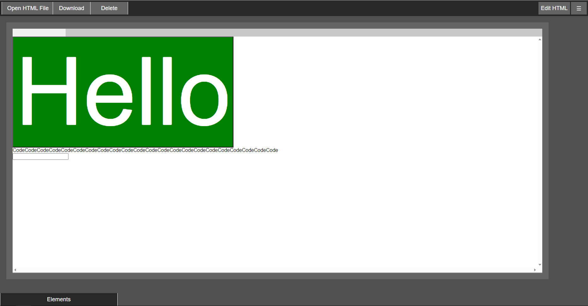
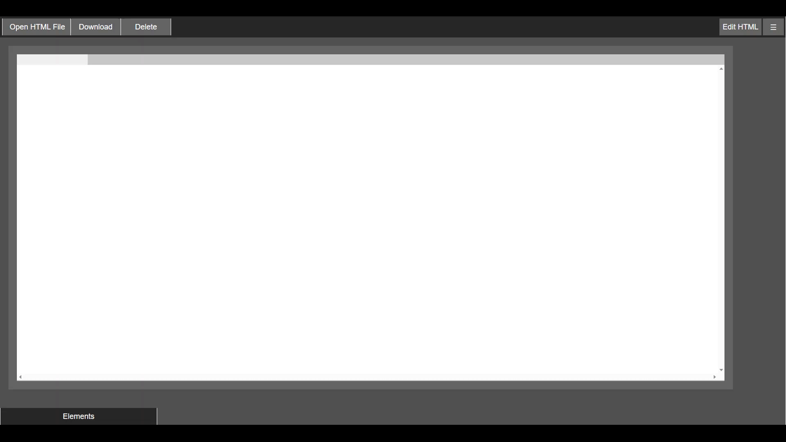
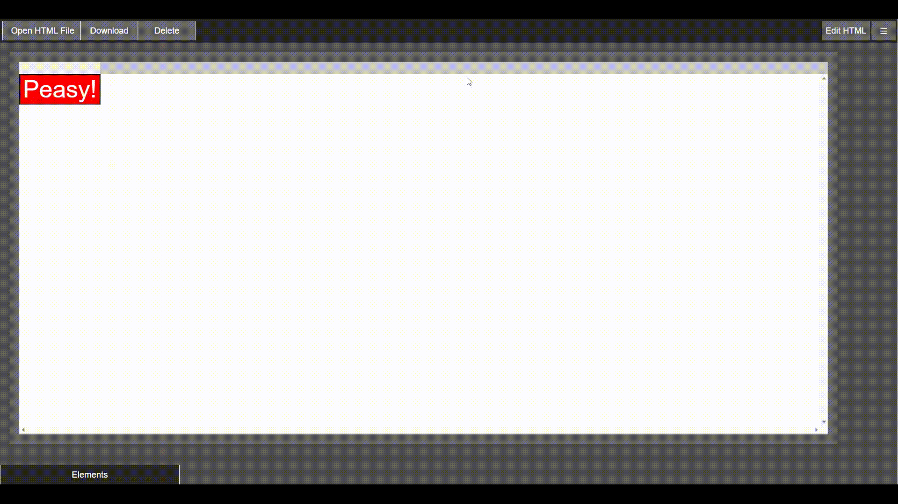
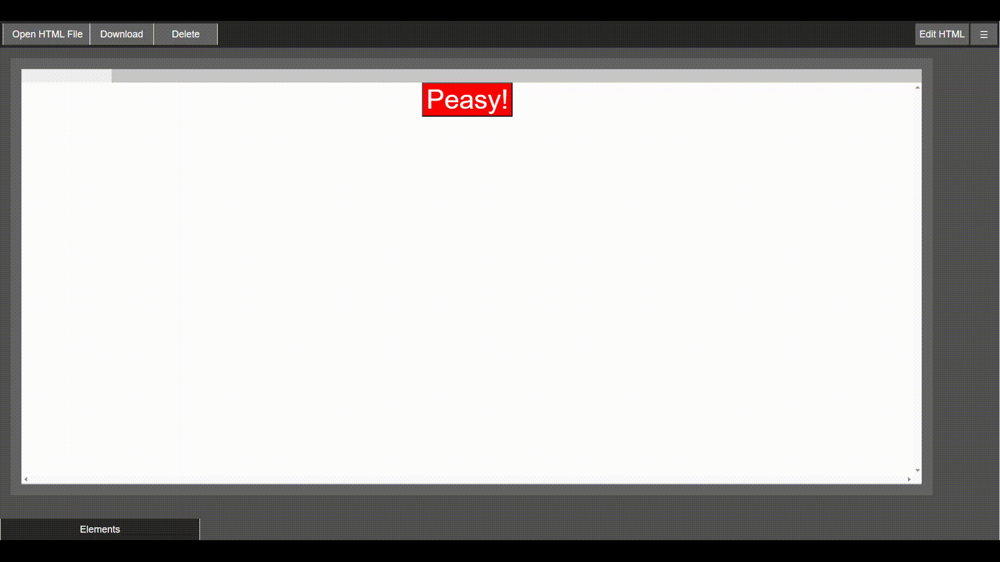

# Infinity Peasy

Make web developing easy.
Make it Peasy.

Infinity Peasy facilitates the process of web developing for HTML/JS/CSS programmers. **Simple web pages** can be created within **10 minutes** and more complex websites can be programmed directly with the open HTML editor interface option given by this application.

**Note: This repo now has a sibling; Version 1.0.0 of Infinity p5, a p5.js editor, has been released: [Repo: Infinity p5](https://github.com/amolgorithm/infinity-p5)**
 
**Consider trying out all editors from the Infinity series!**

## Instantaneous Real-time Preview Of Code
Peasy has an instantaneous preview of the code created. No need to reload anything to view each time your code is modified.
  

    
## *Peasy* Way Of Adding Elements
Just click that button and Peasy adds the elements for you. 
  

    
## Modifying Your Elements
Peasily look at the elements in your website and modify its attributes and style.
Be able to edit **EVERY** property in the latest version of CSS.
  

    
## Direct HTML Editor
Peasy offers an HTML Editor where your code can be directly modified and seen. This can be used to add code for complex web pages.
  

    
## Saving Files
Peasily continue on where you left at in making your website.
Simply download your code as an HTML file and open it later on the application.
  
## Use Peasy!
